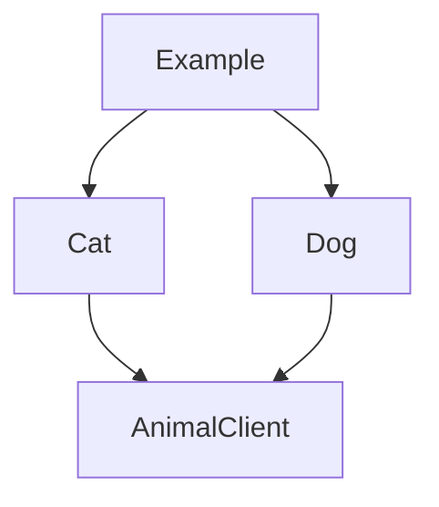
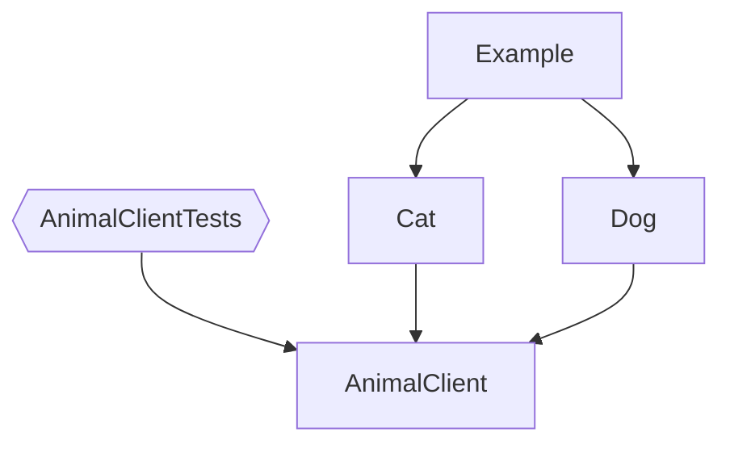
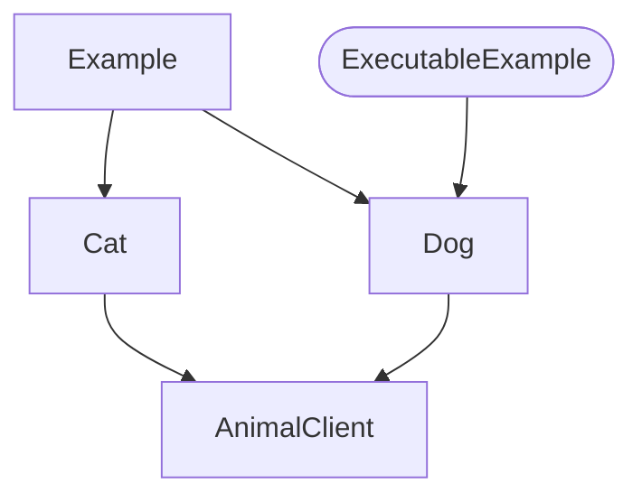
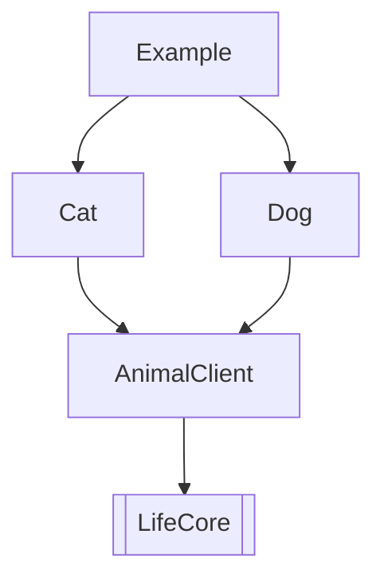
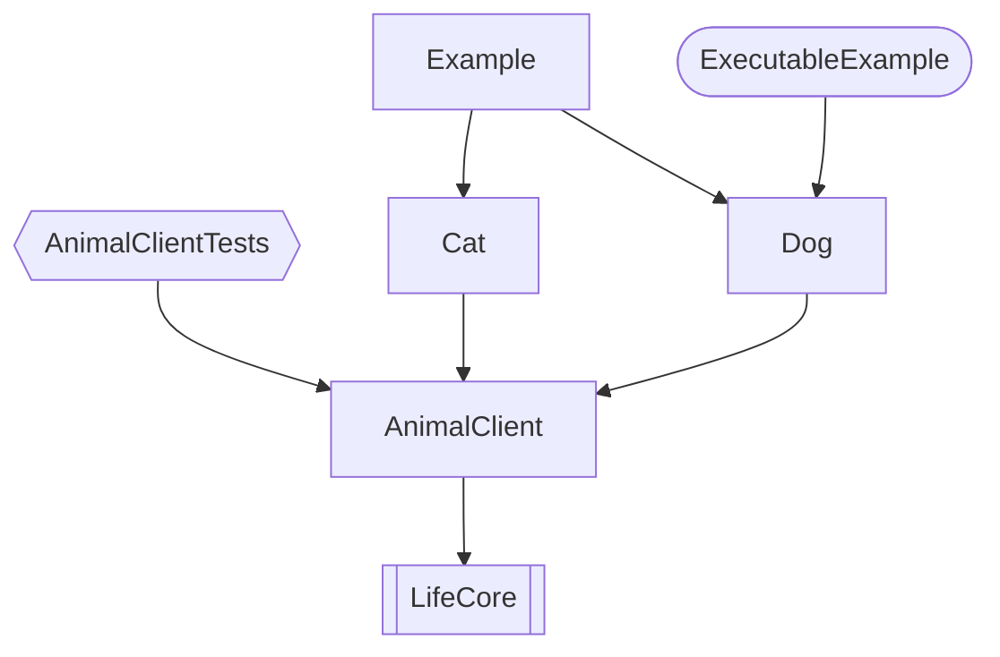
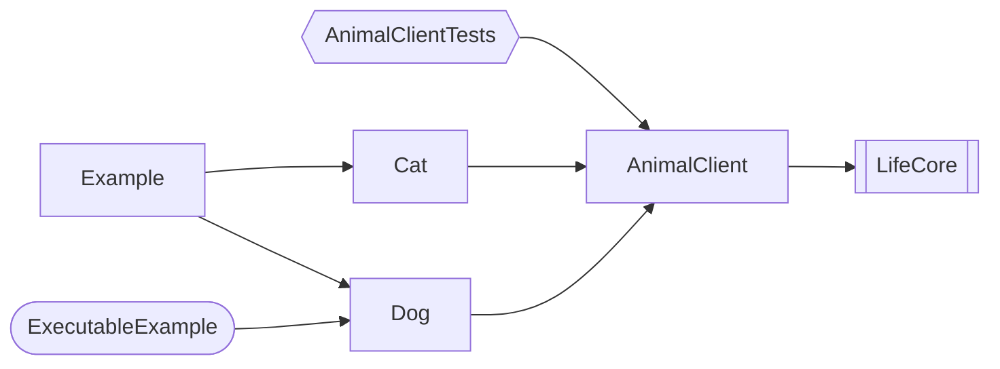
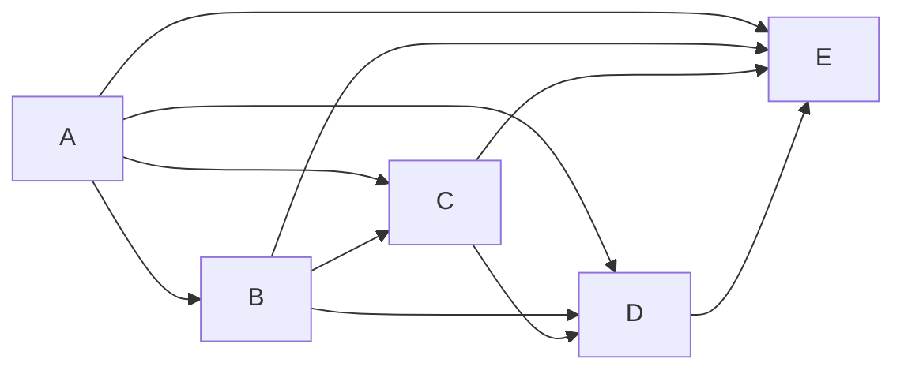
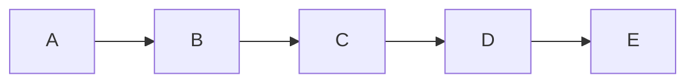

# depermaid - Swift Package Plugin

[depermaid](https://github.com/daikimat/depermaid) is a Swift Package Manager plugin that generates [Mermaid](https://mermaid-js.github.io/mermaid/) diagrams representing dependencies within your Swift package.

## Requirements
```swift
//swift-tools-version:5.9
```

## Usage

1. Add the following line to your `Package.swift` file in the `dependencies` section:

    ```swift
    dependencies: [
        .package(url: "https://github.com/daikimat/depermaid.git", from: "1.0.1")
    ],
    ```

2. Run the following command in the same directory as your `Package.swift` file:

    ```bash
    $ swift package plugin depermaid
    ```

    The generated Mermaid diagram illustrates the dependencies between modules within your Swift package:



## Command Options

You can customize the command options according to your specific use case:

### Including Test Targets

Run the following command to include test targets in the generated Mermaid diagram:

```bash
$ swift package plugin depermaid --test
```



### Including Executable Targets

Run the following command to include executable targets in the generated Mermaid diagram:

```bash
$ swift package plugin depermaid --executable
```



### Including Products

Run the following command to include products in the generated Mermaid diagram:

```bash
$ swift package plugin depermaid --product
```



### Including All

Run the following command to include test targets, executable targets, and products in the generated Mermaid diagram:

```bash
$ swift package plugin depermaid --test --executable --product
```



### Direction

You have the option to define the orientation of the generated Mermaid diagram by utilizing the --direction parameter. The available orientations are TD, TB(same as TD), BT, RL, LR. By default, it's set to TD (Top-Down)."

```bash
$ swift package plugin depermaid --direction LR --test --executable --product
```



### Minimal Dependencies

For packages with a limited reliance on dependencies, the generated graph may appear complex, as illustrated below:



To simplify the graph and focus solely on essential dependencies, run the following command:

```bash
$ swift package plugin depermaid --direction LR --minimal
```

The resulting Mermaid diagram will show a clearer representation by omitting duplicate arrows:



## Examples

To demonstrate the capabilities of Depermaid, a sample project is provided in the `./Example/ExampleDepermaid.xcodeproj`.

### Expected Behavior

Upon successful build and run, Depermaid will analyze the Swift package dependencies in the example project and generate a Mermaid-format graph. This graph will be automatically reflected in this README file, demonstrating the integration of Depermaid to visualize Swift package dependencies. Please refer to this README file when reviewing the generated graph.

The mechanism behind the automatic update of the README file during the build process is implemented using a [custom script](./tool/syncExampleToReadme.sh) added to the Xcode project's Build Phases.

### Build and Run the Example

Follow these steps to build and run the example project:

1. Open the Xcode project:

   ```bash
   open ./Example/ExampleDepermaid.xcodeproj
   ```

2. Make changes to the `./Example/Package.swift` file as needed.

3. Build and run the project from Xcode.

After the build process, please review this README file to see the updated graph reflecting the changes made to the Swift package dependencies.

## License

Depermaid is released under the [MIT License](LICENSE).
